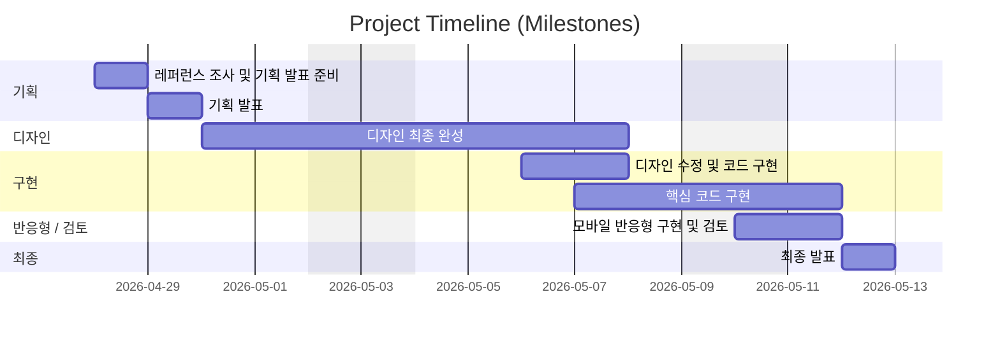

# 이스트소프트 과정 소개 사이트 리뉴얼 (1차 프로젝트)
- 과정명: [13기]프론트엔드 개발자 부트캠프
- 1차 프로젝트: 2026/04/30 ~ 2026/05/12

## 빠른 링크
- 기획서 (피그마 슬라이드): https://www.figma.com/deck/jq4CKvl6IA4QmoDVmZ9EFF
- 디자인 원본 (피그마): https://www.figma.com/design/cTespbRD3YaC5cl353Z5At/%EB%94%94%EC%9E%90%EC%9D%B8-%EC%8B%9C%EC%95%88?node-id=0-1&t=H6c5PgZvNAw2zCrh-1

## 1. 프로젝트 개요
### 1.1 목표
- 기존 정보 나열 중심의 구조에서 벗어나, 정보형 → 전환형 랜딩페이지 구조로 개선
- 사용자가 단순히 내용을 “읽는 것”을 넘어서, 자연스럽게 지원 / 문의 / 관심 - 행동으로 이어지도록 UX 흐름 설계
- 콘텐츠 흐름을 스토리라인처럼 구성하여, 상단에서는 핵심 가치 전달 → 중단에서는 신뢰 확보 → 하단에서는 행동 유도(CTA)로 연결되는 구조 구현
- 모바일 환경에서도 핵심 정보가 빠르게 인지될 수 있도록 스크롤 기반의 직관적인 정보 전달 구조 설계
- 불필요한 정보 탐색 과정을 줄이고, 사용자의 의사결정 속도를 높이는 경량 UX 구조 최적화

### 1.2 팀원

| 이름 | 역할 | 담당 섹션 | GitHub | 연락 |
|------|------|----------|--------|------|
| 김소영 | 팀장 UI 기획 디자인 | 회사소개 / 강사소개 / FAQ / CTA / Footer | [@s0y0ungk](https://github.com/s0y0ungk) | soyo2039@gmail.com |
| 최정원 | FE 리드 UI 기획 디자인 | 혜택 / 이벤트 / PR 영역 | [RaeChoe](https://github.com/RaeChoe) | picasomati@gmail.com |
| 김정우 | UI 기획 디자인 | 문제제기 / 프로그램 소개 | [@casperjwk](https://github.com/casperjwk) | casperjwk@gmail.com |
| 김윤수 | UI 기획 디자인 | 목록/상세 / 검색 / 상태관리 / 접근성 | [@Noonting00](https://github.com/Noonting00) | kys5826911@gmail.com |
| 김찬희 | UI 기획 디자인 | Header / Hero | [@ckck912ck-lang](https://github.com/ckck912ck-lang) | ckck912ck@gmail.com |

### 1.3 단계별 진행

#### 1일차 — 팀 결성 및 시장 조사
- [ ]  팀장 선정, 팀명 선정
- [ ]  레퍼런스 조사 
- [ ]  리뉴얼 웹사이트 분석 및 제작 방향 설정 

#### 2일차 — 스토리보드 및 스타일 가이드 작성
- [ ]  Figma 스토리보드 작성
- [ ]  발표 자료 작성
- [ ]  스타일 가이드, 그리드 작성

#### 3일차 — 프로젝트 이해 & 환경 세팅
- [ ]  Figma 디자인 분석 (레이아웃, 색상, 폰트, 이미지 등 파악)
- [ ]  페이지 구성 요소 목록 작성 (헤더, 네비게이션, 섹션, 푸터 등)
- [ ]  필요한 이미지, 아이콘, 폰트 등의 자산 추출/준비
- [ ]  GitHub 저장소 생성 및 로컬 환경 연결

#### 4일차 — HTML 구조 구현
- [ ]  시맨틱 태그를 사용하여 전체 HTML 골격 작성
- [ ]  헤더/메뉴/메인 섹션/푸터의 기본 마크업 완료
- [ ]  각 섹션별 더미 텍스트/이미지 삽입

#### 5일차 — CSS 기본 스타일링
- [ ]  Figma 기준 색상, 폰트, 간격 적용
- [ ]  공통 스타일(리셋·폰트·변수) 적용
- [ ]  공통요소 스타일 적용
- [ ]  헤더·메인·푸터 등 주요 파트 스타일 완성

#### 6일차 — 세부 디자인 반영
- [ ]  버튼·폼·이미지 등 세부 요소 스타일링
- [ ]  Figma와 디자인 비교·오차 수정
- [ ]  웹표준 & 웹접근성 검사 및 수정
- [ ]  코드 정리 및 주석 작성

#### 7일차 — 기능 점검 & 배포 준비
- [ ]  크로스 브라우저 테스트(Chrome, Edge 등)
- [ ]  ReadMe.md 작성
- [ ]  GitHub Pages 배포 설정
- [ ]  배포 후 URL 공유



#### Frontend
Framework:None
Language: HTML / CSS
Styling: CSS Modules + CSS Variables 기반 디자인 시스템
Routing: None
Image Handling: image
State Management: None

#### Backend (BaaS)
Database:None
Auth:None
Storage: None

#### Tools
Version Control: Git & GitHub
Deployment: Git 저장소
CI/CD: GitHub Actions (테스트 및 배포 자동화)
Design: Figma

### 1.4 배포 URL
- **Production**: https://s0y0ungk.github.io/est_fe_13_1st_project/

### 1.5 개발 컨벤션 가이드

프로젝트에서 사용하는 HTML, CSS, JavaScript 작성 규칙은 아래 문서를 참고하세요.

- [HTML 컨벤션](./docs/guide_html.md)
- [CSS 컨벤션](./docs/guide_css.md)

## 2. 라우팅 구조
| 경로                 | 설명                     | 접근 권한 |
| ------------------ | ---------------------- | ----- |
| `/`                | 메인 홈 (랜딩 페이지 / 섹션형 구성) | 전체    |
| `/problem`         | 문제 제기 / 프로그램 소개        | 전체    |
| `/benefit`         | 혜택 / 이벤트 / PR 영역       | 전체    |
| `/process`         | 과정 소개 / 진행 구조          | 전체    |
| `/review`          | 수강생 후기                 | 전체    |
| `/company`         | 회사 소개                  | 전체    |
| `/lecturer`        | 강사진 소개                 | 전체    |
| `/faq`             | 자주 묻는 질문               | 전체    |
| `/cta`             | 지원 유도 영역               | 전체    |
| `/admin/login`     | 관리자 로그인 페이지            | 비로그인  |
| `/admin/dashboard` | 콘텐츠 관리 대시보드            | 관리자   |
| `/admin/insert`    | 콘텐츠 등록 페이지             | 관리자   |
| `/admin/edit/[id]` | 콘텐츠 수정 페이지             | 관리자   |

---

## 3. 프로젝트 구조
```
1ST_PROJECT/
├─ CSS/
│  ├─ common.css
│  ├─ flex-utility.css
│  ├─ index.css
│  ├─ normalize.css
│  ├─ reset.css
│  └─ responsive.css
├─ images/
├─ common.html
├─ index.html
└─ readme.md
```

## 4. 아키텍처

## 5. 향후 개선 사항
- 모바일 환경에서의 인터랙션 및 UI 디테일 개선
- 섹션별 애니메이션 및 스크롤 기반 인터랙션 추가
- CTA(지원 유도) 전환율 개선을 위한 UX 구조 최적화
- 검색 및 필터 기능 고도화 (카테고리 확장)
- 콘텐츠 관리 편의성을 위한 관리자 페이지 개선
- 이미지 최적화 및 로딩 성능 개선 (Lazy loading 적용)
- SEO 및 Open Graph 설정 강화로 외부 유입 개선
- 코드 구조 리팩토링 및 컴포넌트 재사용성 향상

## 6. 실행 방법
### 1. 클론
```
gh repo clone s0y0ungk/est_fe_13_1st_project
cd portfolio-nextjs_supabase
```

## 2. 제작 후기
- 프로젝트를 진행하면서 단순히 정보를 나열하는 것보다, 사용자가 어떤 흐름으로 페이지를 읽고 행동하는지를 먼저 설계하는 것이 중요하다는 점을 배웠다.
- 정보 구조를 정리하는 과정에서 과정 소개, 커리큘럼, 후기 같은 요소들이 각각 따로 존재하는 것이 아니라, 신뢰 형성과 신청 유도로 자연스럽게 이어져야 한다는 것을 깨달았다.
- FAQ나 후기 같은 콘텐츠가 단순 보조 요소가 아니라, 사용자의 결정에 직접적인 영향을 주는 핵심 요소라는 점도 알게 되었다.
- 디자인 통일성과 반응형 구조는 단순한 완성도가 아니라, 어떤 환경에서도 동일한 경험을 제공하기 위한 필수 요소라는 것을 느낄 수 있었다.

## 3. 기획/디자인 문서
- **기획서(피그마 슬라이드)**: 사용자 여정, 화면 흐름, 요구사항, 실행계획 정리  
  링크: https://www.figma.com/deck/jq4CKvl6IA4QmoDVmZ9EFF
- **디자인 원본(피그마)**: 컴포넌트, 컬러/타이포 스케일, 반응형 레이아웃, 아이콘  
  링크: https://www.figma.com/design/cTespbRD3YaC5cl353Z5At/%EB%94%94%EC%9E%90%EC%9D%B8-%EC%8B%9C%EC%95%88?node-id=382-156&t=H6c5PgZvNAw2zCrh-1

  ### 3.1 미리보기
<!-- /public/readme/ 폴더에 썸네일 PNG를 넣고 경로를 맞춘다 -->
[](https://www.figma.com/deck/jq4CKvl6IA4QmoDVmZ9EFF "피그마 슬라이드로 이동")
[](https://www.figma.com/design/cTespbRD3YaC5cl353Z5At/%EB%94%94%EC%9E%90%EC%9D%B8-%EC%8B%9C%EC%95%88?node-id=382-156&t=H6c5PgZvNAw2zCrh-1 "피그마 디자인으로 이동")

### 3.2 버전 메모
- v1.0 (2026-04-28): 프로젝트 기획 및 레퍼런스 조사 진행
- v1.1 (2026-04-29): 기획 발표 및 프로젝트 방향 최종 확정
- v1.2 (2026-04-30): 디자인 초안 및 전체 UI 구조 설계 시작
- v1.3 (2026-05-05): 디자인 최종 완성 및 스타일 가이드 정리
- v1.4 (2026-05-06): 디자인 수정 반영 및 코드 구현 시작
- v1.5 (2026-05-07): 핵심 레이아웃 및 주요 기능 구조 구현
- v1.6 (2026-05-10): 모바일 반응형 적용 및 전반적인 UI 검토
- v1.7 (2026-05-12): 최종 테스트 및 발표 준비 완료